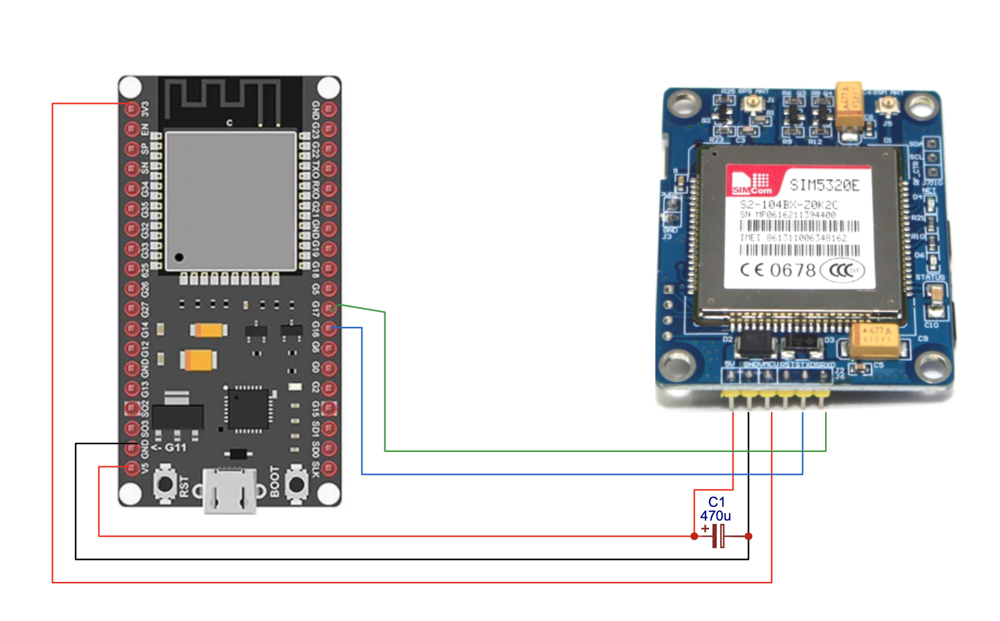
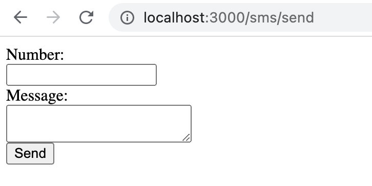

# smsGateway
Simple SMS gateway built by using ESP32 and Node.js

I created this SMS gateway as a base for other IoT projects. The hardware part consists of ESP32 and SIM5320E GSM module.
Instead of SIM5320E module, other GSM modules such as SIM900A or SIM800L can be used. The software part consist of HTTP and WebSockets server
built in Node.js. ESP32 as a client connects to server by using WebSocket. 

## How to use this SMS gateway?

1) Install and run WebSockets and HTTP server:
```Language
cd Nodejs/
npm install
node app.js
```

2) Connect SIM GSM module to ESP32 as shown on schematic (add one capacitor - 470uF close to SIM module between 5v and GND)

| ESP32 | SIM5320E |
| --- | --- |
| 5v | 5v |
| GND | GND |
| 3v3 | VMCU |
| Pin 16 | TXD |
| Pin 17 | RXD |



3) Upload SMS.ino to ESP32 (edit SSID, password and IP address in code)

4) Open http://localhost:3000/sms/send and send SMS


